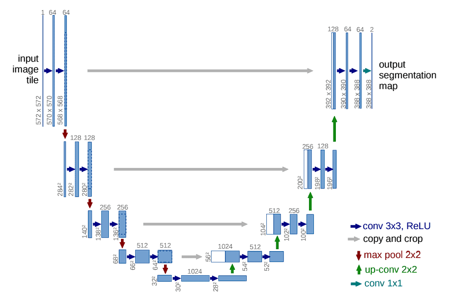
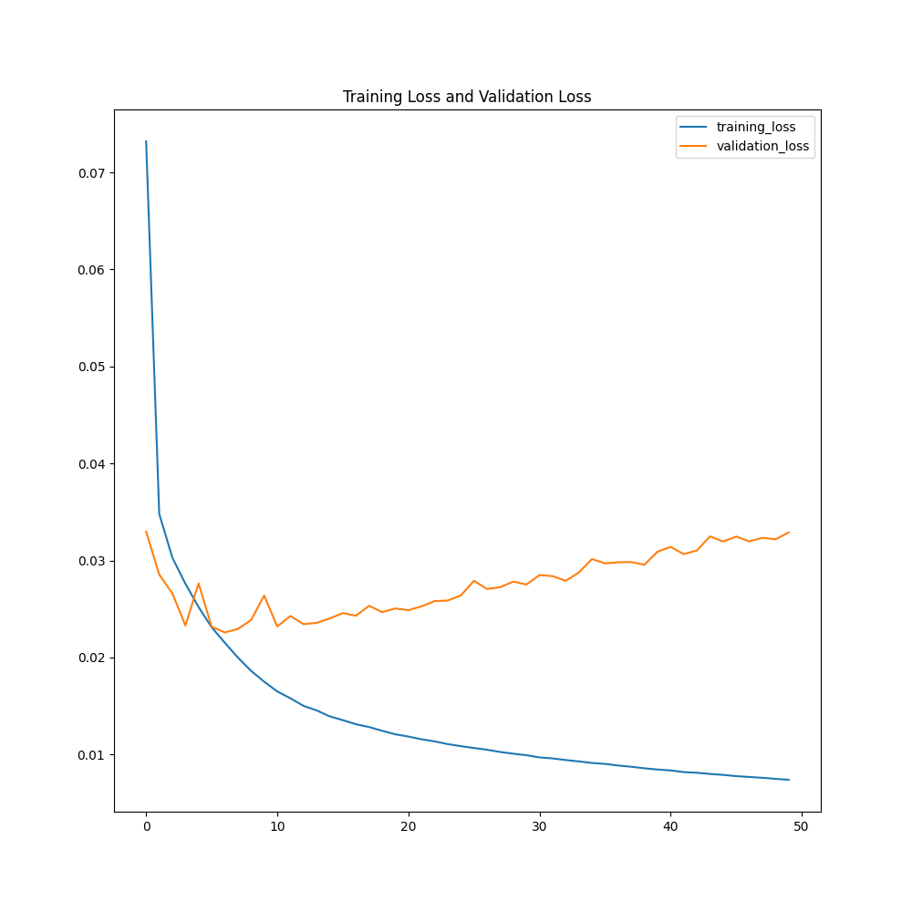
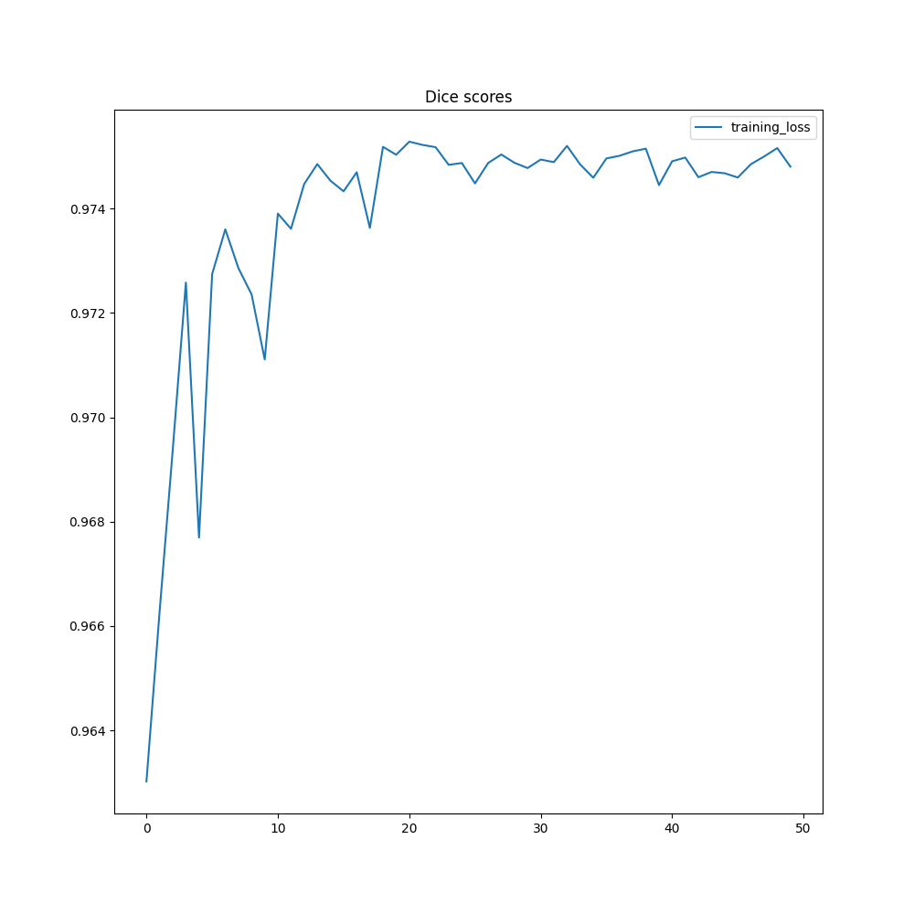
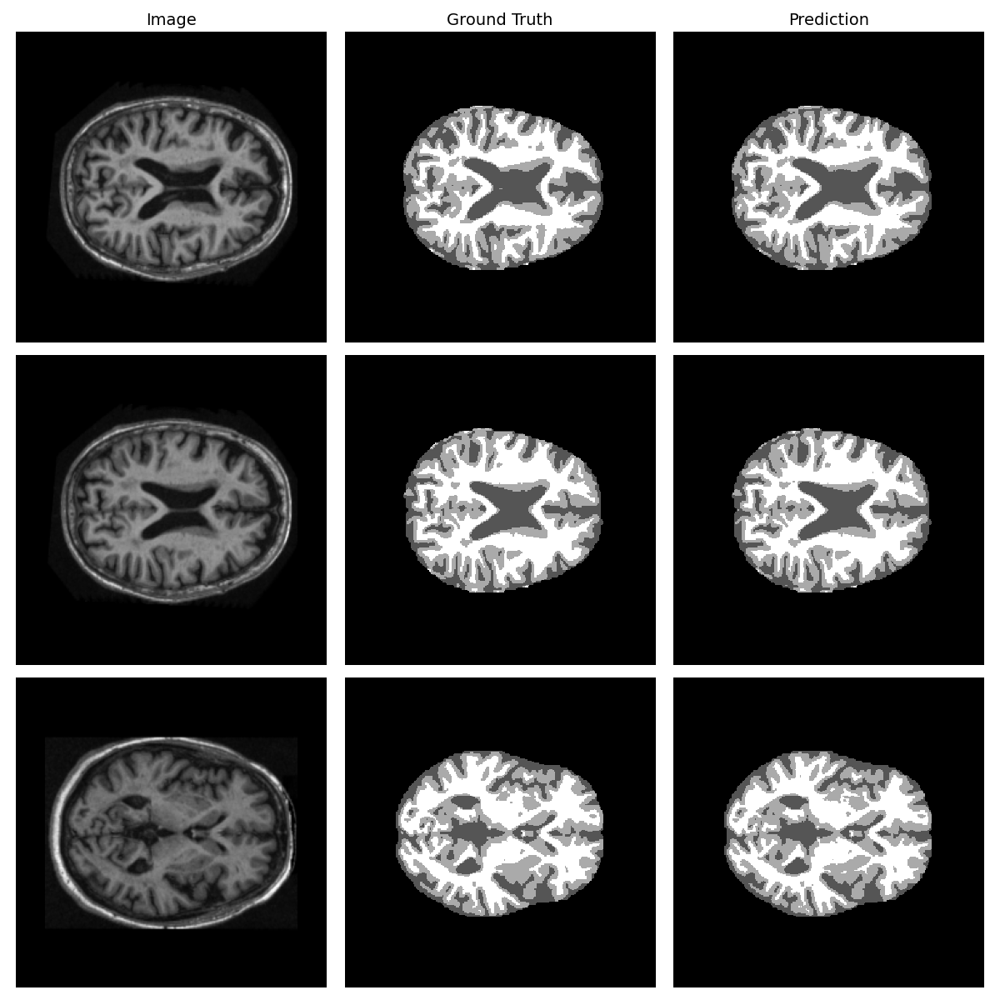

# Semantic Segmentation of the 2D OASIS dataset using Improved UNet

### Davin Alfian - 46223740

## Problem
Brain segmentation is a crucial and critical task within the medical areas. Difficulties in separating gray and white matters (Dénes-Fazakas et al., 2025) or identifying abnormal regions containing tumor (Lin et al., 2021). These tasks require not only high accuracy but also a very time-consuming process. Thus, the DeepLearning model of Improved UNet is introduced to help improve precision and fasten the process while ensuring everyone's safety.  

## Model & How it works
Standard UNet has trouble in dealing with long-range dependencies, blurred boundaries, and low-contrast environment (Al Qurri & Almekkawy, 2023). The improved UNet consist of an encoder-decoder architecture with residual blocks and skip connections. The encoder extract hierarchical features, while the decoder upsamples them to construct a segmentation map. Normalization and dropout are used to improve training and prevent overfitting. In this project, there are four classes that will be output by the model. 

Source: https://viso.ai/deep-learning/u-net-a-comprehensive-guide-to-its-architecture-and-applications/

The model's parameters are as follows: Cross Entropy Loss, Adam Optimizer, learning rate of 1e-4, 50 epochs.
Batch size is set as follows: 
- Training = 4
- Validation = 2
- Testing = 2 

The model calculate the average Dice similarity per batch when training, while when testing each class Dice similarity are calculated separately.

## Dependencies

- Python 3.11.1
- PyTorch 2.9.0+cu128
- Torchvision 0.24.0+cu128
- PIL 12.0.0
- Numpy 2.3.4
- Matplotlib 3.10.7
- CUDA 12.2

The algorithm does not use any random seed outside of fetching random brain scan images when performing the visualization after the training has done. The random seed for visualization is np.random(26).

### To produce the same result:
1. Change dataset directory to your data directory in train.py and predict.py
2. Run the train.py
3. Run the predict.py
4. Enjoy the result

## Dataset 
The dataset consist of 6 folders of 2D brain slices with dimension of 256x256. These are separated into 2 categories: images, and masks. Image represent the original MRI scan, while the masks represent the classes for each pixel. The OASIS dataset has been split accordingly by the source. Due to this, we can follow these splits for the model.

3 folders are for images and 3 folders are for masks.

The images folders are:
- keras_png_slices_test
- keras_png_slices_train
- keras_png_slices_validate

The masks folders are:
- keras_png_slices_seg_test
- keras_png_slices_seg_train
- keras_png_slices_seg_validate

Training data consist of 9664 total images. Validation data consist of 1120 total images. Lastly, Test data consist of 544 total images.

### Preprocessing
Few preprocessing was done to the dataset to ensure that the model will be able to accurately capture the classes within the images. The images are normalized by being scaled to [0, 1] and then standardize. On the other hand, the masks were changed from [0 85 170 255] to [0 1 2 3] (by dividing them with 85) to follow the model class indices.

## Input and Output
The algorithm input only takes a couple of things. The number of channels, the number of classes, and the directory of the dataset. These information will be used to train the model. The output of the training will be the model checkpoint when it had the best average dice score.

Alongside the checkpoint, the model will also calculate the Dice similarity scores to measure how well it functions. The model test results can be seen as follows:

| Classes  |  Dice score  |
| -------- | ------------ |
|    1     |    0.9993    |
|    2     |    0.9602    |
|    3     |    0.9624    |
|    4     |    0.9766    |

### Visualization
Here are some plots showing the plots. 

These are the training/validation losses and the dice score during training

    
    

Additionally, here are some visualization showing the trained model's prediction

As you can see, the similarity between the prediction and ground-truth is evident in the high accuracy achieved by the model.

## References

- Dénes-Fazakas L, Kovács L, Eigner G, Szilágyi L. Enhanced U-Net for Infant Brain MRI Segmentation: A (2+1)D Convolutional Approach. Sensors (Basel). 2025 Feb 28;25(5):1531. doi: 10.3390/s25051531. PMID: 40096351; PMCID: PMC11902485.

- Lin M, Momin S, Lei Y, Wang H, Curran WJ, Liu T, Yang X. Fully automated segmentation of brain tumor from multiparametric MRI using 3D context deep supervised U-Net. Med Phys. 2021 Aug;48(8):4365-4374. doi: 10.1002/mp.15032. Epub 2021 Jul 11. PMID: 34101845; PMCID: PMC11752426.

- Al Qurri, A., & Almekkawy, M. (2023). Improved UNet with Attention for Medical Image Segmentation. Sensors (Basel, Switzerland), 23(20), 8589. https://doi.org/10.3390/s23208589

‌